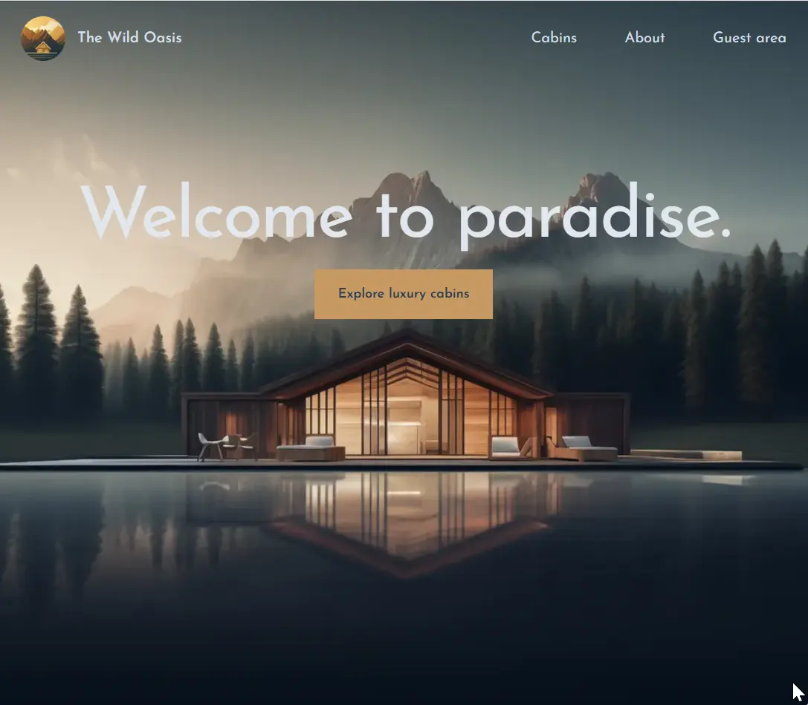

### Hi!  **I am Erhan ERTEM**

&emsp;

## Udemy The Ultimate React Course 2024: React, Redux & More by Jonas Schmedtmann

### **Objective:** Create the Wild Oasis Website for Customers

<strong>Key take-aways from this project...</strong>

- React server component (RSC) architecture

  - Sharing data @ RSC
    - Server-component(SC) to Client-component(CC) flow
      - Passing fetched data from via propping
      - Using children propping
    - Client-component(CC) to Server-component(SC) flow
      - Mutating data using API endpoint with route handling
      - Sharing filter state via URL (searchParams)
        - usePathname() hook
        - useSearchParams() hook
        - useRouter() hook
    - Client-component(CC) to Client-component(CC) flow
      - Utilizing Context API for sharing state/props around
  - Use CC in a SC
    - Use 'use client' directive in CC when CC passes a server boundary
  - Use SC in a CC
    - Push a SC into CC as a children prop in a parenting SC

- <strong>'App'</strong> based NextJS folder structure and project planning

  - Root Segment
    - Create NextJS root (entry page/root segment)
    - Create a NextJS root layout
  - Child/Nested Child Segments
    - Create NextJS routes/nested routes (pages/segments)
    - Create a NextJS layout in a nested route
  - Params/Dynamic Segments
    - Setup params route
    - Create dynamic metadata via generateMetaData() nextjs fn
    - Turn dynamic params routes to static routes using generateStaticParams() nextjs fn

- Component import handling in NextJS

  - Configure path alias for app folder / VSCODE auto import integration

- Navigation in NextJS

  - NextJS Link Component
    - Static routes
    - Dynamic params routes
  - usePathname() NextJS CC hook to read current URL

- Image handling in NextJS and relavant attributes

  - NextJS Image Component
    - Inline referencing
      - Configure NextJS for URL images
    - External referencing

- Loader handling in NextJS

  - Establish a global loader for SSC routes (pages/segments)
  - Establish custom loader @ segment level (segment and its nested routes)
  - Employ <strong>React Suspense Mechanism</strong> on code portions that is subject to extended loading times to improve UX.
    - key propping @ Suspense

- Error handling in NextJS

  - Setup global NextJS error boundary to prevent page breaks on erronous code in production
  - Setup automatic triggering global NextJS not-found-error handling for mistyped routes/segments
  - Setup manual triggering not-found-error handling for mistyped dynamic routes(params)
  - Setup segment level NextJS not-found-error handlers

- Revalidation handling

  - Component level revalidation
    - noStore() for PPR (future)
  - Route level revalidation
    - revalidate object
      - Enforce SSG+ISR rendering strategy
      - Enforce dynamic rendering strategy

- Authnetication via AuthJS

  

&emsp;

<strong>In addition to the project cirriculum:</strong>

- N/A

  &emsp;

<strong>Pending Issues:</strong>

- N/A

#### [The Wild Oasis Website](https://website-wild-oasis-erhan-ertem.netlify.app)

---

